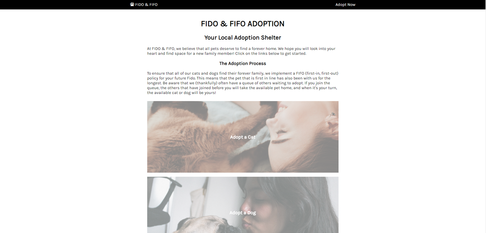
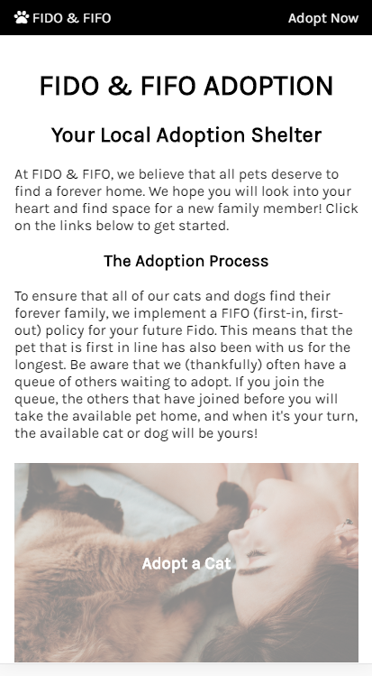
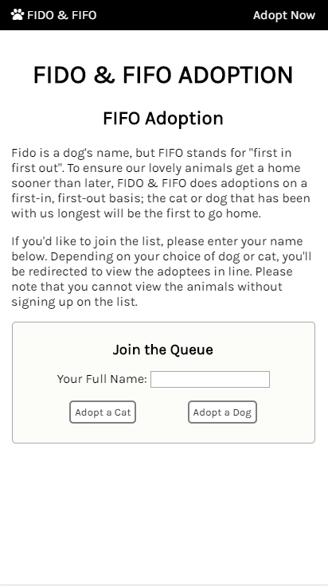
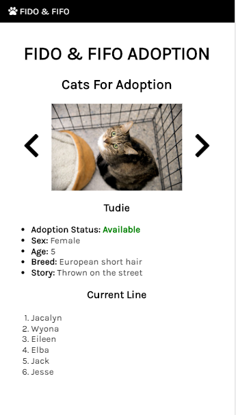

# Petful - Client

## Links
- [Live App](https://petful.shiningjustice.now.sh)
- [Deployed Server](https://ancient-everglades-87501.herokuapp.com/api)
- [Server Repo](https://github.com/thinkful-ei-gecko/)

## Views 

> Desktop View

> Landing Page (Mobile View)

> Signup Page

> Adopt Page

## App
Petful is an adoption app for cats and dog. The adoption process works strictly on 'First-In, First-Out' basis. People can adopt a cat or a dog that is first in queue. People are also put in a queue, and are able to adopt when it's their turn.

## Tech Stack (Front End)
- React, React Router, HTML5, CSS3